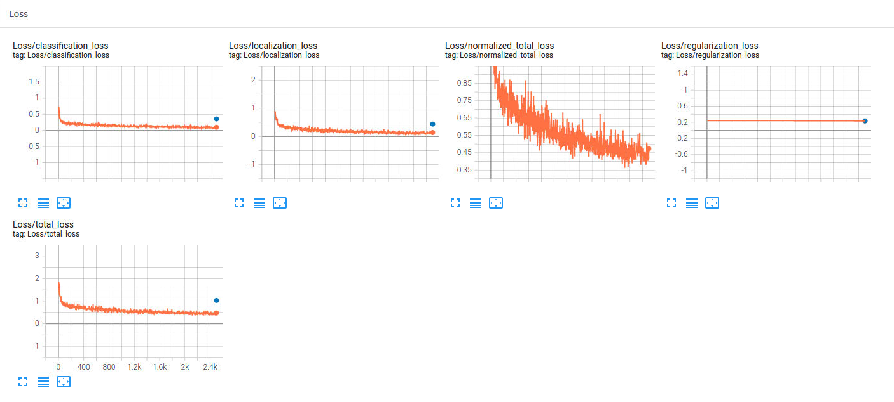

# Object Detection in an Urban Environment

## Data

For this project, we will be using data from the [Waymo Open dataset](https://waymo.com/open/).

[OPTIONAL] - The files can be downloaded directly from the website as tar files or from the [Google Cloud Bucket](https://console.cloud.google.com/storage/browser/waymo_open_dataset_v_1_2_0_individual_files/) as individual tf records. We have already provided the data required to finish this project in the workspace, so you don't need to download it separately.

## Submission Template

### Project overview
This section should contain a brief description of the project and what we are trying to achieve. Why is object detection such an important component of self driving car systems?

Object recognition is a crucial phase and rudimentary one  in the realm of self driving car, in this project, our aim is to identify some object of interest in which we can navigate, drive and do the required tasks efficiently and safly

### Dataset
#### Dataset analysis
This section should contain a quantitative and qualitative description of the dataset. It should include images, charts and other visualizations.

 The data consist of variety of objects like: cars, pedestrian, cyclist. Our aim is to recongize those \n
    "objects and classify them so we can enable the Self driving car to have an initial system of perception\n
    \n
    Few observation about the dataset:
    - Some scense's annotation are missing which increase the likelihood of false negative in the model 
    - Some scense are too dark, which is good to provide the model with such
    - Objects distance from the camera perspective are vary from image to image 
    - The dataset is quite divrse as it includes scense trhoughout the whole day time, as well as all weather conditions.

As for the classes distribution:

"As we can see, we have biased dataset towards vehicles, which have many ways to overcome \n"
1- Through loss function, by using focal loss. Based on our research, best value for easy/hard examples (0.25, 2 for both alpha and gamma, recpectively) \n
2- Through augmentation, by replicating the dataset, or includes\n, new images of black backgrounds, or using copyPaste and so on \n
We'll implement some augmentation to help us overcome this bias, also by observing some of the images above, doing random cut will help the model not to focus alwyas on the streat, instead, look for other objects (hypothesis), also some noise might help i.e. gaussian noise, as the dataset includes image of different circumstances"

#### Cross validation
This section should detail the cross validation strategy and justify your approach.

As for the cross validation, as per convention between data scientist, it's usually better to have almost 20/80 for training/validation.\n
Since we have a testing dataset here, I splitted the training into 77 % of the overall dataset, while 13, 10 for validation, and testing, respectively

### Training
#### Reference experiment

This is the reference experiment, and we can observe that the dataset doesn't converge, instead, it blowed up and resonated a lot, which most likely due to high learning rate, which
makes the model jump from minima to minima without clear path, so we will reduce it on the improved version. Also, by viewing the augmentation pipeline, and viewing the images above, there is a variety of day and weather conditions, it terms of luminance, btightness, object existence, number of objects, occlusion, and so on. 

#### Improve on the reference

So, I had addressed some issues, mostly, colors related, like brightness adjustment, and contrast to try making the model focus/not focus on the edges of relevant objects. Also, some images' objects are very distant, so I incorporated scaling factor to enlarge/minimize those images. And the most important thing was reducing the learning late, which helped the model significantly

